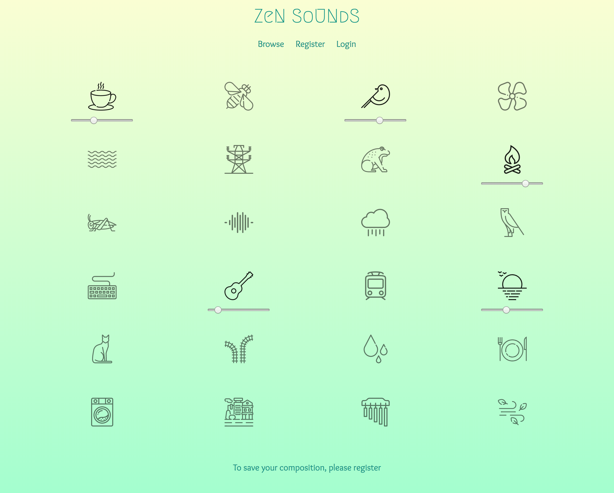

# Zen Sounds

This was my final project at GA. It is a React application where the users can mix together predefined ambient sounds, like bird songs and wind chimes, to create their preferred background noise. These compositions can be saved for later, edited, and optionally made public for other people to browse via a REST API.

## Prerequisites

- Node.js
- yarn
- MongoDB
- Chrome or Firefox to run the app

## Build

Clone this repository:

    git clone https://github.com/weresquirrel/wdi-project-4 <project-dir>
    cd <project-dir>

install dependencies:

    yarn install

create mongo database schema and populate with sample data:

    yarn run seed

run the application in development mode:

    # in separate terminals
    yarn start:server
    yarn start:client

or run as standalone application (by default on port 4000):

    yarn start

## Technologies used
- React
- Web Audio API
- Node.js
- Express.js
- MongoDB
- JWT
- Bootstrap CSS only
- SCSS
- Balsamiq
- Trello

## Experience / Challenges Faced

This project was the most fulfilling at GA. I created something I could not imagine earlier that I'd be able to do, and also what I truly liked both as a technical challenge and as an end-product. Especially as it was an idea of my own, not a pre-defined task.

The main challenge was to enable users to mix multiple sounds with adjustable volumes together. I’ve only seen simple audio files embedded in HTML documents earlier, so I had to dig in to the Web Audio API to make it happen.

## Future plans / roadmap

- Organize sounds into categories / filter them by category on UI
- Add possibility to rate compositions
- Sort all compositions by popularity
- Improve both testing and error handling

## Acknowledgement
- freesound.org
- flaticon.com
